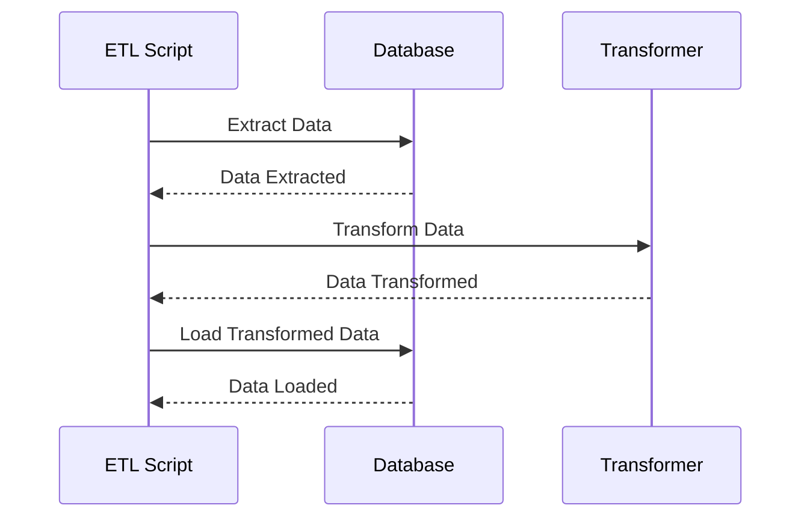

This is a work in progress. It is not yet ready for use.

Soon as possible I will add some examples about how to extract data from spreadsheet or migrate informations from a database to another using temporary tables and triggers.

### ETL Scripts

This project contains a set of scripts that perform extract, transform, and load (ETL) tasks on data sources. These scripts are designed to facilitate the data pipeline process, allowing for the automated extraction and manipulation of data from various sources, and the loading of that data into a target database or data warehouse.

### Diagram of ETL Process Flow



### Extract

The extract phase of the ETL process involves retrieving data from various sources. This could include databases, APIs, or flat files such as CSV or JSON. The scripts in this project are designed to extract data from a variety of sources, using the appropriate methods and libraries for each source type.

### Transform

The transform phase involves manipulating the data in some way, such as cleaning, formatting, or aggregating it. The scripts in this project include various functions and methods for performing these transformations, allowing you to easily modify the data to meet the needs of your analysis or reporting.

### Load

The load phase involves writing the transformed data to a target destination, such as a database or data warehouse. The scripts in this project include functions and methods for loading the data into a variety of target systems, including popular databases like MySQL and PostgreSQL, as well as cloud-based data warehouses like Amazon Redshift and Google BigQuery.

### Dependencies

The scripts in this project rely on a number of libraries and dependencies. A full list of these dependencies, along with version information, can be found in the `package.json` file.

# Installation
```bash
npm install
```

### Usage

To use the ETL scripts in this project, you will need to modify the configuration settings in the `plugins/index.js` file to reflect the specifics of your data sources and target systems. Then, you can execute the scripts as needed to perform the ETL process on your data creating them in a specific folder called `/jobs`.

As an example you can check it out the `jobs` folder and the `jobs/index.js` file. In this file you can see how to use the scripts to extract data from a database, transform it and load it into another database.
